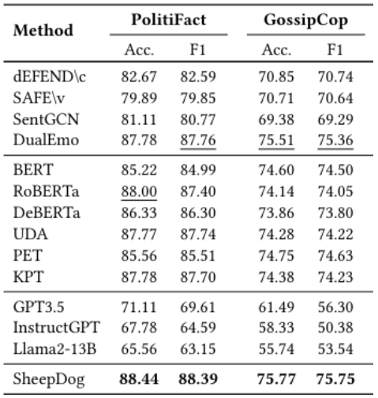
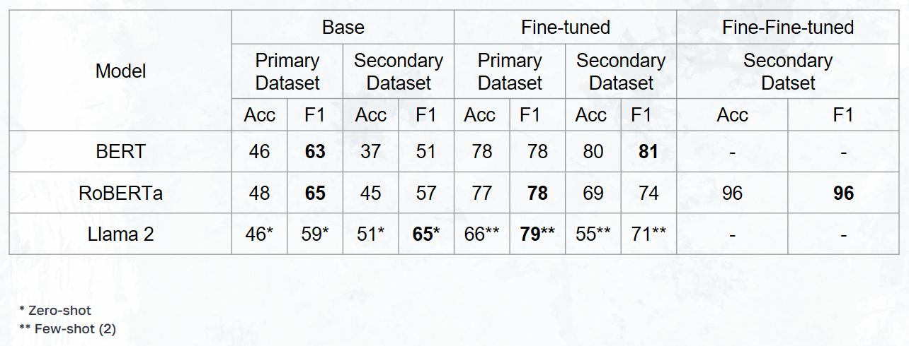

# From Deception to Detection: Evaluating and Optimizing Language Models (LMs) to Detect LLM-Edited Fake News

## Contributors

- **Ali Azarsina**
- **Majid Faridfar**
- **Bardia Khalafi**

## Abstract

As AI-generated content becomes more prevalent, detecting language model (LLM)-edited fake news presents a growing challenge. This study evaluates BERT, RoBERTa, and Llama (2,3) models for identifying fake news edited by LLMs. We created an LLM-edited corpus by rewriting a human-written fake news dataset (PolitiFact and GossipCop of FakeNewsNet) with Llama 2. Observing a performance drop in detection accuracy, we addressed this by (1) prompt engineering with zero- and few-shot learning using Llama, (2) fine-tuning BERT and RoBERTa on the original dataset, and (3) fine-tuning RoBERTa on the LLM-edited dataset. Fine-tuning on the LLM-edited dataset achieved the highest accuracy, highlighting the importance of tailored training strategies in combating LLM-driven disinformation.

## Introduction

The automated detection of fake news has long been a challenging task. With the emergence of large language models (LLMs), creating highly convincing, harder-to-detect fake news has become possible. This project addresses this issue by creating a secondary dataset of fake news using LLMs to rephrase existing fake news content, making it more deceptive. We then assess the performance of detection models on both original and LLM-enhanced datasets, focusing on improving robustness against LLM-generated misinformation.

## Related Work

Recent studies reveal that LLM-generated misinformation is harder to detect than human-written misinformation. Various strategies, including prompt engineering and new detection models like SheepDog, have been proposed, but improvements remain limited. Inspired by these efforts, we use the FakeNewsNet repository to generate LLM-enhanced fake news and evaluate existing detection models' performance on this dataset.

## Baselines

Based on prior work, we select BERT, RoBERTa, and advanced models like DeBERTa as baselines. These models, particularly RoBERTa and DeBERTa, show high accuracy on FakeNewsNet data. We used these as baselines to evaluate their performance on our secondary dataset.

## Methodology

### Dataset Creation
- **Primary Dataset**: We sourced fake news articles from the FakeNewsNet dataset (GossipCop and PolitiFact).
- **Secondary Dataset Generation**: Using Llama 2-7B, we rephrased the primary dataset, generating semantically similar but linguistically diverse fake news articles. This expanded dataset allows us to assess model sensitivity to LLM-generated content.

### Model Evaluation
- **Baseline Evaluation**: BERT, RoBERTa, and Llama-2 were evaluated on both datasets. Without fine-tuning, models showed low detection accuracy, necessitating fine-tuning on the dataset subset to establish a performance baseline.
- **Accuracy Comparison**: Testing on the LLM-generated dataset revealed a notable accuracy decrease, supporting our hypothesis that LLM-generated content challenges conventional detection models.

### Comprehensive Analysis
- **Error Analysis**: We found a performance drop when models encountered LLM-generated content, indicating a need for robust solutions across varied writing styles.
- **Model Enhancement**: To address performance degradation, we fine-tuned the RoBERTa model on the secondary dataset. This led to a substantial improvement, with the RoBERTa model reaching an F1-score of 0.96.

### Final Evaluation
- **Performance Benchmarking**: We conducted final evaluations of our enhanced models on both datasets to benchmark improvements, documenting the results in this report.

## Result

## Data

Our primary data source was the FakeNewsNet dataset, focusing on the GossipCop subset due to its suitable size and structure. After preprocessing, we reduced sample size for compatibility with model context windows and used 500 fake and 500 real news samples from GossipCop for our secondary LLM-enhanced dataset.

---

## References

- Chen, C., Shu, K. (2023). *Can LLM-generated misinformation be detected?* ICLR.
- Shu, K., et al. (2020). *FakeNewsNet: A data repository with news content for studying fake news on social media.* Big Data.
- Su, J., et al. (2024). *Fake news detectors and LLM-generated content bias.* NAACL.
- Wu, J., Hooi, B. (2023). *Fake news in sheep’s clothing: Robust fake news detection.* arXiv.
- Zhang, X., Gao, W. (2023). *Towards LLM-based fact verification on news claims.* IJCNLP-AACL.
